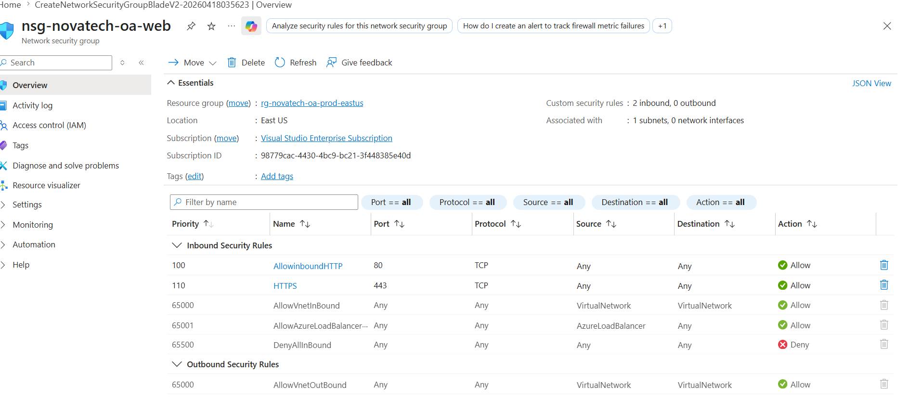

# ☁️ Use Case 1: Cloud Foundation (Azure)

## 🚀 Project Overview
This project demonstrates the design and implementation of a secure and scalable cloud foundation in Microsoft Azure. It covers core infrastructure components such as networking, compute, storage, security, and monitoring.

The goal is to simulate a real-world enterprise setup (NovaTech) while applying Azure best practices aligned with AZ-104 and AZ-305 concepts.

---

## 🧱 Architecture Components

- **Resource Groups & Tagging**
- **Virtual Network (VNet) & Subnets**
  - WebSubnet
  - AppSubnet
  - DataSubnet
- **Network Security Groups (NSGs)**
- **Virtual Machines (Web Server - NGINX)**
- **Azure Storage Account**
- **Backup Vault**
- **Azure Advisor Recommendations**
- **Monitoring & Logging (Activity Log)**

---

## 📁 Repository Structure

UseCase1-Cloud-Foundation/
├── screenshots/
│ ├── 01-resource-group-tags.png
│ ├── 02-vnet-subnets.png
│ ├── 03a-nsg-web-rules.png
│ ├── 03b-nsg-app-rules.png
│ ├── 03c-nsg-data-rules.png
│ ├── 04a-vm-overview.png
│ ├── 04b-nginx-browser.png
│ ├── 05-storage-overview.png
│ ├── 06-backup-vault.png
│ ├── 07-azure-advisor.png
│ └── 08-cleanup-confirmation.png
├── thought-process.md
└── challenge-answers.md

---

## 📸 Project Evidence (Screenshots)

### Resource Group & Tagging

### VNet & Subnet Design

### NSG Rules (Web Layer)

### VM Deployment & NGINX

### Storage Configuration

---

## 🧠 Key Learnings

- Implemented secure network segmentation using subnets and NSGs  
- Enforced governance using Azure Policy concepts  
- Designed for high availability and disaster recovery  
- Applied storage redundancy strategies (LRS vs GRS/GZRS)  
- Used Activity Logs for auditing and monitoring  
- Practiced real-world cloud architecture decision-making  

---

## 📄 Documentation

- 👉 `thought-process.md` — Detailed explanation of architecture decisions  
- 👉 `challenge-answers.md` — Solutions to scenario-based Azure questions  

---

## 🎯 Skills Demonstrated

- Azure Infrastructure Deployment  
- Cloud Security & Governance  
- Networking (VNet, Subnets, NSGs)  
- Compute (Virtual Machines)  
- Storage & Backup  
- Monitoring & Logging  
- Problem Solving (Scenario-based design)  

---

## 🏁 Conclusion

This project reflects a foundational understanding of Azure cloud architecture and demonstrates the ability to design, implement, and document a production-like environment.

---

## 👩‍💻 Author

**Okeke Anthonia Chiamaka**  
Aspiring DevOps Engineer | Cloud Enthusiast